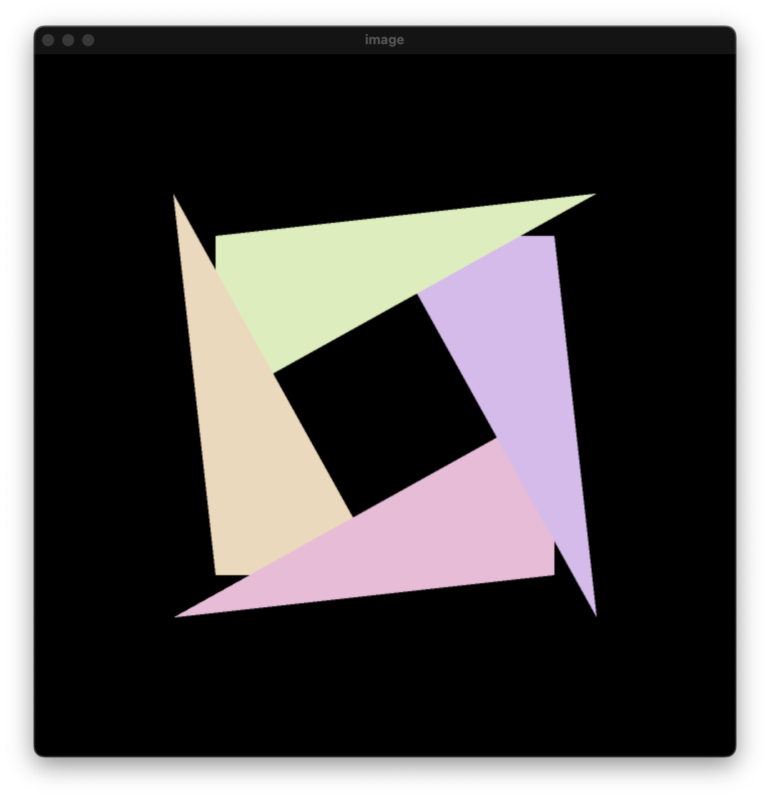

# Games101-Homework2-Scanline-rendering-method

 改进的Games101 作业2 使用速度更快的渲染方案 (Not using bounding box, but Scanline rendering) 没有使用bounding box, 而是复杂度更低的扫描线(Standard approach) 同时实现抗锯齿操作 (also implied MSAA)

From: BiT Virtual Reality Project 1

## 项目结构

Result & Program 是链接完成的程序 (Compiled program & has Linked) 

其中包含1 2 两个版本

1是原始图像 (1 is the original graph)

2是改进后的图形 (2 is the modified graph)

同时又包含MSAA 和 No_MSAA 两种版本

MSAA 实现了抗锯齿操作 (MSAA with Multisample anti-aliasing)

No_MSAA 为不包含多重采样反走样的版本 (No_MSAA without Multisample anti-aliasing)

实现效果见图

## 源代码

主要修改了rasterizer 类 (modified rasterizer class)

以及rasterizer.hpp 头文件 (also modified rasterizer.hpp head file)

I love Ann